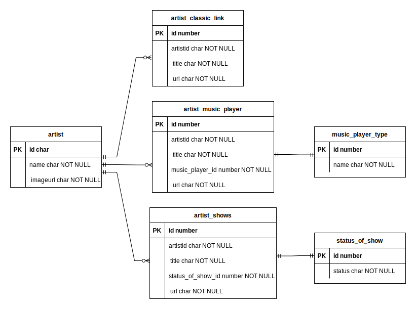

# The Problem
We have three new link types for our users.

1. Classic
	- Titles can be no longer than 144 characters.
	- Some URLs will contain query parameters, some will not.
2. Shows List
	- One show will be sold out.
	- One show is not yet on sale.
	- The rest of the shows are on sale.
3. Music Player
	- Clients will need to link off to each individual platform.
	- Clients will embed audio players from each individual platform.
	
You are required to create a JSON API that our front end clients will interact with.

- The API can be GraphQL or REST.
- The API can be written in your preferred language.
- The client must be able to create a new link of each type.
- The client must be able to find all links matching a particular userId.
- The client must be able to find links matching a particular userId, sorted by dateCreated.


## Your Solution

- Consider bad input data and the end user of your API - we're looking for good error handling and input validation.
- If you are creating a GraphQL API, think about the access patterns the client may use, and think about the acces patterns the client may not use. Try not to [Yak Shave](https://seths.blog/2005/03/dont_shave_that/)
- Consider extensibility, these are 3 of hundreds of potential link types that we will be developing.


## Rules & Tips

- Choose the language and environment of your choice, just include documentation on how to run your code.
- Immutability and functional programming is looked upon favorably.
- You cannot connect to a real world database - document your schema design.
- Mocking third parties is looked upon favorably.
- @todo comments are encouraged. You aren't expected to complete the challenge, but how you design your solution and your ideas for the future are important.

---
# Submission
Set up your own remote git repository and make commits as you would in your day to day work. Submit a link to your repo when you're finished.
---

# The Solution

## Context

### Libs and frameworks

This solution is built with the below
- express, express-graphql
- apollo-server-express, apollo-server-core
- knex
- sqlite2

### Dependent tools

- Git
- Node
- npm
- sqlite3

### Local install for libs

```
npm i
```

### Local setup for sqlite3

From root directory, the below will setup and initialise the database
```
mkdir local-db
cat ./local-db-setup/data-setup.sql | sqlite3 ./local-db/linktree.db
```
'beatles_1234' is the id of the artist/user present


### Running the app (GraphQL API)

```
npm run graphql-gen-types && npm run start
```

### Running the tests

```
cat ./local-db-setup/data-setup.sql | sqlite3 ./local-db/linktree.db
npm run test
```

### Running the server with nodemon (GraphQL API)

```
npm run graphql-gen-types && npm run dev
```

### Data Model



